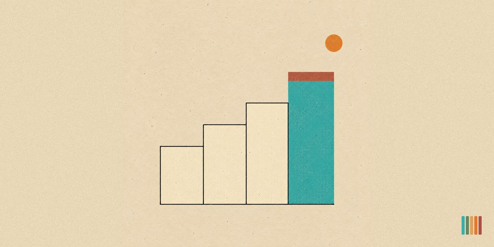

# pvc-git-commit-message-local

<p align="center"></p>

  

> Writes a git commit message in PVC format from `git status` and `git diff`, then runs the commit locally. Never pushes.

A Claude Code skill for anyone working in local-only repos where Claude should finish the job, not hand back text to paste. Made by Pro Vibe Coding. The skill reads the working tree, picks a SemVer bump from the diff, writes the message in `vX.Y.Z - headline` format, stages the named paths, commits through a heredoc, and reports the short hash. It never pushes, never adds a remote, never sets an upstream.

The `-local` in the name means Claude runs the commit in your repo instead of handing you the message to run yourself. A print-only sibling exists but is not published, so this repo is the one to install.

## Table of Contents

- [Key Features](#key-features)
- [Install](#install)
- [Usage](#usage)
- [The PVC Commit Format](#the-pvc-commit-format)
- [Local Execution](#local-execution)
- [Output Rubric](#output-rubric)
- [Known Limitations](#known-limitations)
- [Sources](#sources)
- [Changelog](#changelog)
- [License](#license)

## Key Features

- Reads `git status`, `git diff`, `git diff --staged`, and `git log` in parallel, then commits locally.
- Bumps SemVer 2.0.0 from the last commit: PATCH for fixes and docs, MINOR for new functionality, MAJOR for breaking changes.
- Honors the 0.y.z initial-development phase. A "would be major" change pre-1.0.0 stays MINOR.
- Stages the named paths for the work at hand, never `git add -A` blindly.
- Commits through a single-quoted heredoc so the multi-line message survives Windows shell quoting.
- Local only, absolute: never pushes, never adds a remote, never sets an upstream.
- Reports the short hash after each commit.
- Three handled paths: happy commit, untracked-only first commit, and clean-tree refusal (no invented messages).
- Voice-checked against the PVC ban list before committing (no em dashes, no "ship", no "leverage" as verb).

## Install

This is a Claude Code skill. Two install paths.

### Project-local (recommended)

Copy the skill folder into the local-only repo where you want Claude to commit:

```text
<your-repo>/.claude/skills/pvc-git-commit-message-local/
```

Name the folder exactly `pvc-git-commit-message-local`, matching the frontmatter name, because the folder name becomes the command name. The skill activates for any Claude Code session opened in that repo.

**From the GitHub release zip:** it unpacks to a folder named `pvc-git-commit-message-local-<version>` (for example `pvc-git-commit-message-local-0.4.0`). Rename that folder to `pvc-git-commit-message-local` before you place it. A project or personal skill takes its command name from the directory name, so an unrenamed folder shows up as `/pvc-git-commit-message-local-0.4.0`. A `git clone` gives you the right folder name already.

### Personal (available across all your projects)

Copy the skill folder to your user-level skills directory:

```text
Windows:        %USERPROFILE%\.claude\skills\pvc-git-commit-message-local\
macOS / Linux:  ~/.claude/skills/pvc-git-commit-message-local/
```

Because this skill commits on its own, install it personally only if you want that behavior in every repo you open. To keep it to chosen repos, use the project-local install and leave it out of the repos where you run commits by hand.

Restart Claude Code after copying so the skill loads at startup.

### Verify the install

Open Claude Code in the repo you copied the skill into, or in any project if you installed it personally, then ask:

```text
What skills are available?
```

Confirm `pvc-git-commit-message-local` appears in the list with its description. See [REQUIREMENTS.md](REQUIREMENTS.md) for what the machine needs (git and a repo).

## Usage

Make changes in a working tree, then ask Claude Code to commit. Any of these phrasings trigger the skill:

```text
commit this
make a commit
git commit
/pvc-git-commit-message-local
wrap this up
save my changes
```

Agent response (happy path):

```text
PATCH from v1.4.2 to v1.4.3, behavior fix, no public API change.

v1.4.3 - Fixed Wrong Status Code on /api/leads Validation Error

- Returned 422 instead of 500 when payload missing required fields
- Added regression test covering the missing-email case
- Updated error response shape to include the failed field name

committed a1b2c3d
```

The skill stages the named paths, runs the commit, and reports the short hash. It never pushes and never adds a remote.

## The PVC Commit Format

```text
vX.Y.Z - Headline Summarizing the Main Change

- first concrete change
- second concrete change
- third concrete change
```

Rules:

1. First line is `vX.Y.Z - headline`. No quote characters anywhere. A blank line follows it, then the bullets begin (the git subject and body separator).
2. Body lines start with `- ` (hyphen, single space), one concrete change per bullet.
3. Past-tense verbs throughout (added, fixed, changed, removed, renamed, wired, refactored).
4. 3 to 7 bullets target. Under 3 is acceptable when the diff genuinely contains fewer changes. Over 7 forces grouping by file family.
5. No em dashes, no inner quotes, no PVC-banned phrases.
6. Inline code references inside bullets stay plain text, no backticks (a backtick is PowerShell's escape character and corrupts the commit). Quoted strings use single quotes.
7. No GitHub autolink triggers: no word starting with `@`, and no bare `#` before digits unless you mean that issue.
8. No attribution trailers. The message ends at the last bullet.

## Local Execution

What this skill does at commit time:

- Stages the specific paths for the work at hand. It avoids `git add -A` unless the repo is known-clean, and if the repo holds gitignored private folders it confirms a path is ignored before staging near it.
- Commits through a heredoc via the Bash tool so the multi-line message survives Windows shell quoting.
- Never pushes, never adds a remote, never sets an upstream. If the host project's CLAUDE.md allows pushing, that rule belongs to the project, not to this skill; the skill still never pushes on its own.
- Reports the short hash for each repo committed.

Install this skill in the repos where you want Claude to run the commit for you.

## Output Rubric

Every commit this skill produces scores against these dimensions. A failing message gets regenerated, not committed.

| Dimension              | Pass criteria                                                                                                                      |
| ---------------------- | --------------------------------------------------------------------------------------------------------------------------------- |
| format_exact           | First line matches `^v\d+\.\d+\.\d+ - .+$`. A blank line separates the headline from the body. Body lines match `^- .+$`. Zero double-quote and zero backtick characters in the body. |
| version_bump_valid     | Follows SemVer 2.0.0. A repo at 0.y.z never jumps to 1.0.0 without user opt-in.                                                    |
| bullet_count           | 3 to 7 bullets, or fewer when the diff supports it, or grouped when over 7.                                                        |
| concrete_subjects      | Every bullet names a specific file, function, route, or feature. Zero vague nouns.                                                 |
| voice_consistency      | Zero em dashes. Zero PVC ban-list matches.                                                                                         |
| grounded_in_diff       | Every bullet maps to a real hunk in `git diff` or a real file in `git status`. Zero hallucinated changes.                          |
| local_commit_executed  | The commit runs locally through a heredoc on named paths and the short hash is reported. Zero push, zero remote or upstream change. |
| edge_case_coverage     | Handles clean tree (refusal), first commit, no prior PVC version in log, staged plus unstaged ambiguity, binary-only diffs, many-file grouping. |
| internal_vs_public     | New internal-only files default to PATCH, not MINOR. New publicly-exported symbols are MINOR.                                      |
| headline_length        | Target 50 chars, hard cap 60. Past tense always. Title Case.                                                                                  |

## Known Limitations

- Does NOT push, add a remote, or set an upstream. Local commits only.
- Does NOT run `git add -A` blindly. It stages the named paths for the work at hand.
- Does NOT bump the version in `package.json`, `pyproject.toml`, or any source file. The version lives only in the commit message.
- Does NOT write CHANGELOG.md entries or release notes.
- Does NOT enforce Conventional Commits prefixes (`feat:`, `fix:`). The PVC format uses `vX.Y.Z` instead.

## Sources

Grounded in:

- [Semantic Versioning 2.0.0](https://semver.org/) for MAJOR, MINOR, PATCH bump rules and the 0.y.z phase
- [Conventional Commits 1.0.0](https://www.conventionalcommits.org/) for internal change classification
- Tim Pope, ["A Note About Git Commit Messages"](https://tbaggery.com/2008/04/19/a-note-about-git-commit-messages.html) (2008) for subject and body length conventions
- [Keep a Changelog 1.1.0](https://keepachangelog.com/) for grouping categories (Added, Changed, Fixed, Removed)
- PVC voice rules, the ban list in SKILL.md

## Changelog

- **v0.4.1 (2026-09-22).** README shows the cream banner `assets/pvc-git-commit-message-local-banner.jpg` full width under the title, the card art on a sheet in its own paper color with the PVC five-bar mark bottom right; the social preview matches it with the mark bottom left. Docs only, no change to what the skill does.
- **v0.4.0 (2026-09-17).** First public release under Apache 2.0. Added the Apache License 2.0, a NOTICE file, an SPDX header in SKILL.md, a public TRADEMARK.md, REQUIREMENTS.md and the README artwork under `assets/`. Format rule 8 (no attribution trailers) added 2026-09-16. README rewritten for a public reader.
- **v0.3.0-local (2026-07-15).** First packaged release of the local-executing variant: single-dash bullets, Title Case headlines, the blank line between headline and body, and local commit execution on named paths.

## License

This project is licensed under the [Apache License 2.0](LICENSE). See [LICENSE](LICENSE) and [NOTICE](NOTICE) for details.

"Pro Vibe Coding" and "PVC" are trademarks. The license does not grant rights to use them. See [TRADEMARK.md](TRADEMARK.md).

Claude and Claude Code are trademarks of Anthropic. This project is independent. It is not affiliated with, endorsed by, or sponsored by Anthropic.
